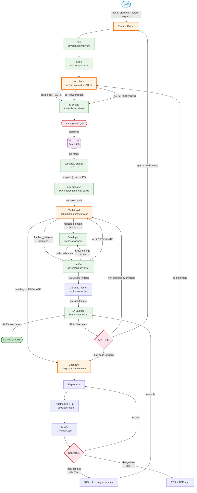
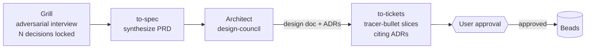
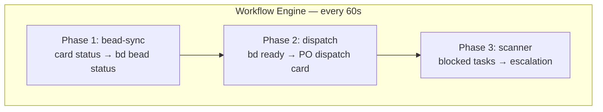
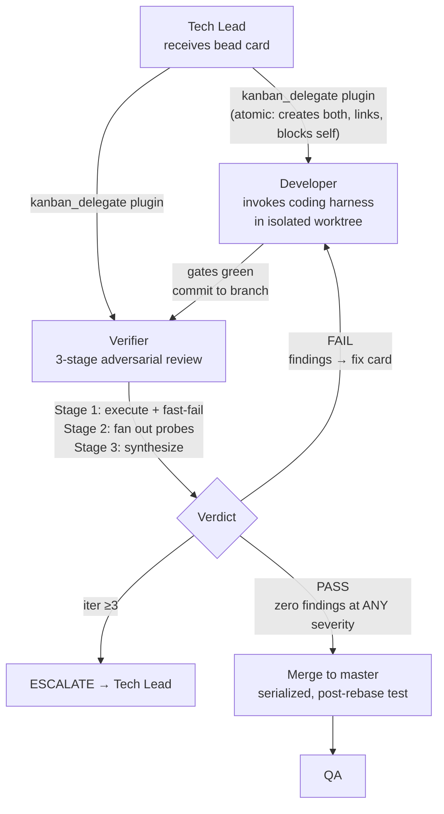
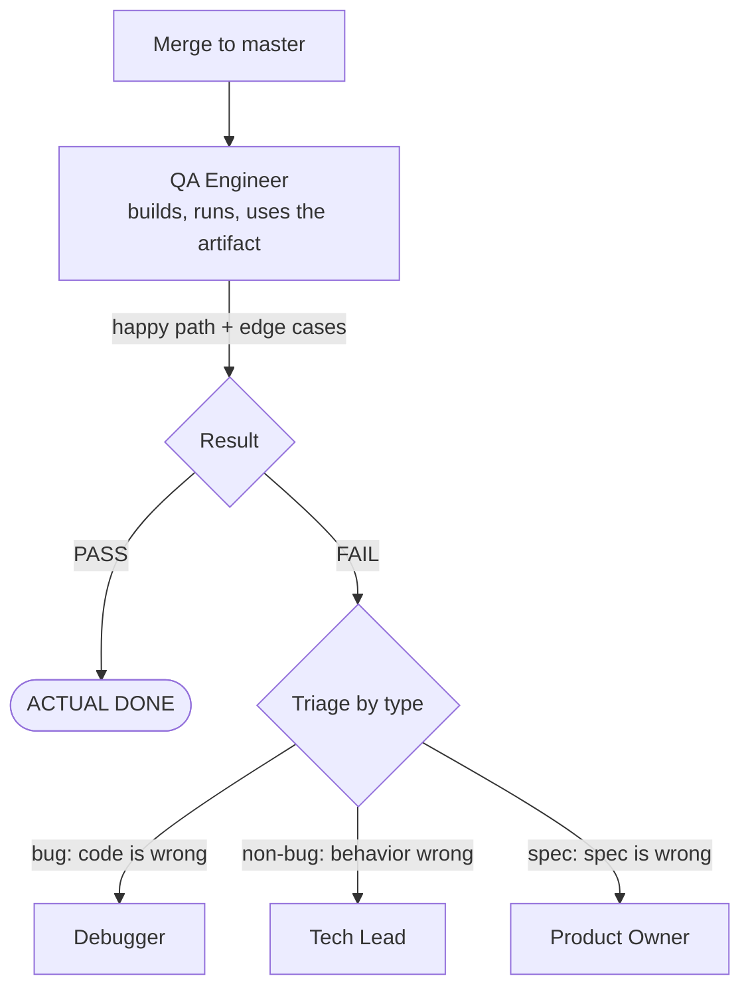
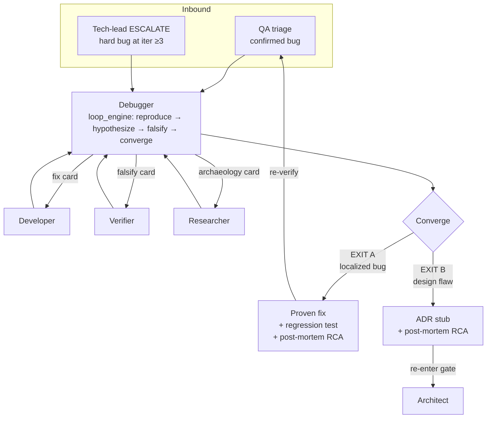
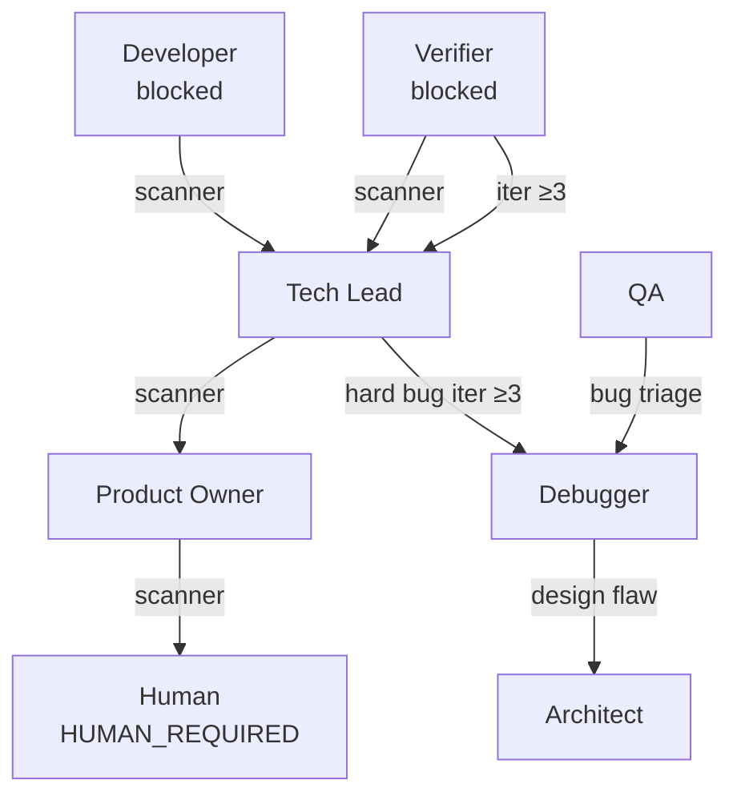

# Hermes Startup Team — Architecture

> How 12 specialized agent profiles coordinate to take a project from idea to shipped artifact.

## Profiles

| Profile | Role | One-liner |
|---------|------|-----------|
| **product-owner** | Front door | Single entry point. Routes work, files issues, contracts the user for decisions. |
| **builder** | Prototyper | Takes raw ideas, grills them, builds prototypes, presents for promotion. |
| **architect** | Design partner + gatekeeper | Owns irreversible decisions. Runs design-council, produces ADRs. |
| **tech-lead** | Construction orchestrator | Designs coding loops, delegates to developer + verifier via kanban_delegate. |
| **developer** | Harness wrapper | Thin governance around vendor coding harnesses (Claude Code, Codex). Generates code. |
| **verifier** | Adversarial evaluator + merge-owner | Reviews output (not reasoning), fans out probes, owns the merge gate. Zero-findings = PASS. |
| **debugger** | Diagnosis orchestrator | Reproduce → hypothesize → falsify → converge. Dispatches fixes, never writes code. |
| **qa** | Last gate before shipping | Tests the assembled, running artifact. Builds it, runs it, breaks it. No code reading. |
| **researcher** | Deep knowledge engineer | Depth-first research, Obsidian wiki curation, cited synthesis. |
| **scout** | Fast trend scanner | Breadth-first AI frontier scanning, daily digest, files deep-research tasks. |
| **ops** | Platform engineer | Owns the dev environment — tools, configs, infrastructure. |
| **advisor** | Strategic sparring partner | YC-level startup advisor. Pressure-tests strategy, fundraising, GTM. |

## The Three Orchestrators

Three profiles can initiate work chains via `kanban_chains` or `loop_engine`:

- **Architect** — design fan-out (researcher + peer perspectives → ADR)
- **Tech-lead** — construction fan-out (developer + verifier → merged feature)
- **Debugger** — diagnosis fan-out (developer fix + verifier falsify → proven fix)

The rest are workers or single-session agents.

---

## The Full Production Pipeline



---

## Phase-by-phase detail

### 1. Planning (Product Owner)

The PO is the front door. The skill index in the PO's SOUL.md routes incoming requests:

| Trigger | Skill loaded | What happens |
|---------|-------------|--------------|
| New project idea / migration | `project-kickoff` | Routes to `project-kickoff-grill` then `project-kickoff-spec` |
| Prototype promotion | `project-promotion` | Creates project structure, board, bd epic. Dispatches to PO. |
| Feature work on existing project | `dev-planning` | Discuss → `to-spec` → `to-tickets` |
| Workflow engine dispatch card | `dev-dispatch` | Creates tech-lead cards from ready beads |
| Discovery cron | `project-discovery` | Scans projects, updates steering state |

**Enforcement point:** The PO's SOUL.md is identity-only (charter). It contains zero inlined procedures. The skill index points to skills that own the process. This prevents the PO from improvising beads via `bd create` without loading `to-tickets`.

### 2. Grill → Spec → Architect → Tickets



**Architect two modes:**
- **Design partner** (new project): PO creates a design card. Architect runs `design-council` via `loop_engine` — researcher + peer-architect fan-out through `kanban_chains`, PO interview gate, ADR recording. Output: design doc + ADR series.
- **Gatekeeper** (incremental change): T0-T3 blast-radius triage. T0 = wave through. T1+ = ADR via `design-council`.

**to-tickets:** Breaks the spec into vertical tracer-bullet slices — each cuts through every layer (schema, API, logic, tests) and is independently demoable. Each ticket cites the relevant ADRs. The skill quizzes the user for approval before publishing.

### 3. Workflow Engine (cron, zero-token)

Runs every minute via `workflow-engine.py` on the product-owner profile:



Reads `active-projects.json` to know which projects to scan. Empty list = silent exit, zero tokens.

### 4. Construction (Tech-lead → Developer → Verifier)



**Role separation (load-bearing):**
- Developer = the Generator. Never reviews, scores, or approves its own work.
- Verifier = the Checker. Never writes code. Reviews output, not reasoning (trace-blind by default).
- This separation is what makes adversarial verification meaningful — if the same agent graded its own work, the review would be compromised.

**Verifier merge gate:** The verifier owns the merge. It acquires the merge slot (`bd merge-slot`), rebases onto main, re-runs the full test suite on the rebased candidate, then merges. Serialized — one slot holder at a time.

**Inner FAIL loop (runs without tech-lead):** Verifier files findings as a `REVIEW-ITERATION` comment on the developer card, creates a fix card (developer warm-resumes the prior harness session), and a fresh review card. The developer and verifier iterate without tech-lead involvement until PASS or iteration ≥3.

### 5. QA (last gate — tests the running artifact)



QA does NOT read code. QA tests the assembled, running artifact — the actual thing a user would interact with. "The unit tests passed" means nothing to QA; it trusts only what it personally observed by running the thing.

### 6. Debugger (diagnosis orchestrator)



The debugger is the third orchestrator. It never writes code — it dispatches developer cards for fixes, verifier cards for falsification, researcher cards for environment/log archaeology. It holds the breadcrumb ledger (repro, ranked hypotheses, instrument results) on the root card's blackboard.

**Two exits:**
- **EXIT A (localized bug):** Proven minimal fix + regression test + post-mortem (RCA). Handed back to QA/originator for re-verification. The loop closes.
- **EXIT B (design flaw):** Root cause is architectural — no correct test seam exists, or the bug spans a boundary. RCA + ADR stub re-enters the architect gate. The bug becomes an architecture decision.

---

## Escalation Chain



The board scanner (workflow engine Phase 3) detects blocked tasks and escalates to the next-level profile on the same board. Blocked tasks with a `HUMAN_REQUIRED` comment are skipped — they need a human, not an escalation card.

---

## Board Model

One board per project. All profiles work on all boards (n-to-n).

```
~/.hermes-teams/startup/kanban/boards/
├── crr-pos/          ← CRR POS v2
├── domainguard/      ← DomainGuard
├── team/             ← cross-project ops
└── hermes-hq/        ← HQ / default
```

`active-projects.json` maps projects to boards. The workflow engine only scans registered projects. Adding a project: create the board, add the entry, the engine picks it up on the next tick.

---

## SOUL.md Architecture

Each profile has a SOUL.md with two sections:

1. **Base identity** (above SPECIALTY block) — shared across all profiles. Constitution, bootstrap protocol, team coordination footer.
2. **SPECIALTY block** (between `<!-- SPECIALTY:BEGIN -->` and `<!-- SPECIALTY:END -->`) — identity-only charter: role, stance, handoffs, skill index.

The SPECIALTY block follows the `writing-great-soul` skill principles:
- **No inlined procedures** — if a procedure lives in the charter, it becomes a stale duplicate of the skill
- **No rosters** — each charter states only its own ownership, not teammates'
- **No rule lists** — collapsed to stance-level principles
- **Skill index** — trigger conditions pointing to skills, zero procedural content

---

## Component Map

| Component | Location | Purpose |
|-----------|----------|---------|
| `workflow-engine.py` | `product-owner/scripts/` | Combined cron: bead-sync + dispatch + scanner |
| `kanban_delegate` plugin | `tech-lead/plugins/dev_workflow/` | Creates dev+verifier cards atomically |
| `loop_engine` | architect/debugger tool | Converge-loop driver for design-council and debug-loop |
| `hygiene-guard.sh` | `product-owner/scripts/` | Scans for stale/orphan beads |
| `active-projects.json` | `startup/` | Project → board registry (workflow engine reads this) |
| `writing-great-soul` | `shared-skills/` | Reference skill for SOUL.md editing |
| `writing-great-skills` | `shared-skills/mattpocock/` | Reference for skill authoring |
