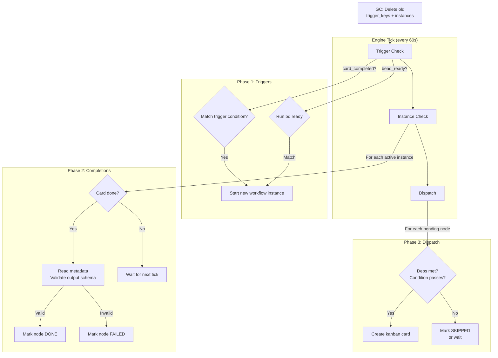
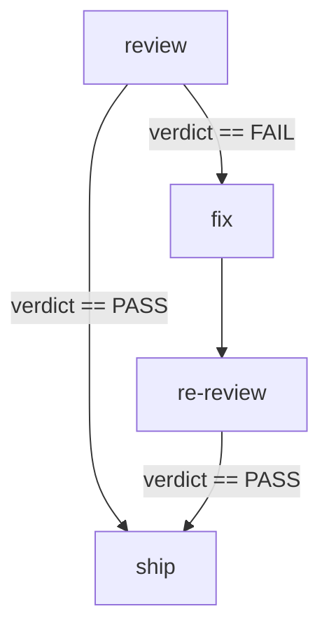

# Workflow Engine

A declarative workflow engine for Hermes that orchestrates multi-agent pipelines
through JSON templates. Each template defines nodes (work steps), edges
(conditional routing), and triggers (what starts the workflow). The engine
creates kanban cards, waits for real agents to complete them, reads their
output, and advances the workflow — all from a 1-minute cron tick.

**270 tests. 0 failures. 2 code review rounds. Real pipeline proven.**

---

## Table of Contents

- [What It Does](#what-it-does)
- [How It Works](#how-it-works)
- [Architecture](#architecture)
- [Template Format](#template-format)
- [Node Types](#node-types)
- [Edge Types](#edge-types)
- [Triggers](#triggers)
- [Input/Output Schemas](#inputoutput-schemas)
- [Variable Resolution](#variable-resolution)
- [CLI Commands](#cli-commands)
- [Example Templates](#example-templates)
- [Migration from Old Cron](#migration-from-old-cron)
- [Testing](#testing)
- [Design Decisions](#design-decisions)

---

## What It Does

The engine replaces hard-coded pipeline phases with JSON templates. Instead of
editing Python code to change how work flows between profiles, you edit a JSON
file:

**Before (old cron):**
```
if verifier card done and verdict == PASS:
    create QA card on board
    assign to qa profile
    load live-testing skill
```

**After (engine template):**
```json
{
  "id": "qa-loop",
  "trigger": {"source": "card_completed", "condition": {"assignee": "verifier", "metadata.verdict": "PASS"}},
  "nodes": [{"id": "qa_retest", "profile": "qa", "skill": "live-testing", "body_template": "Re-test the merge"}]
}
```

The engine handles everything: detecting the trigger, creating the card,
waiting for completion, reading output, advancing to the next node.

---

## How It Works

The engine runs on a 1-minute cron tick. Each tick executes 3 phases:



### Phase 1: Trigger Check

Scans all kanban boards for card completions that match workflow trigger
conditions. If a verifier card completes with `verdict=PASS` and a workflow
has a trigger for that condition, the engine starts a new instance.

**Self-trigger prevention:** Cards created by the engine itself (idempotency
key starts with `wf:`) are checked against the trigger workflow's ID. A card
created by `qa-loop` will NOT re-trigger `qa-loop`, but CAN trigger a different
workflow like `re-verify`.

### Phase 2: Completion Check

For each active workflow instance, checks if dispatched nodes' cards are done.
When a card completes:
1. Reads the card's completion metadata from the kanban DB
2. Validates the metadata against the node's output schema (JSON Schema)
3. If valid: marks node DONE, stores output for downstream variable resolution
4. If invalid: marks node FAILED, blocks downstream nodes

Also checks foreach nodes (all child cards must complete), subworkflow nodes
(child instance must complete), and card regression (DONE cards that reverted
to todo/running).

### Phase 3: Node Dispatch

For each PENDING node whose dependencies are met:
1. Evaluates conditions (implicit `node.condition` or explicit edge conditions)
2. Validates input schema (required variables present in context)
3. Creates a kanban card assigned to the node's profile
4. Marks node DISPATCHED with the card ID

If a condition fails, the node is marked SKIPPED (terminal state). A workflow
completes when ALL nodes reach a terminal state (DONE, FAILED, or SKIPPED).

### Garbage Collection

At the start of each tick, the engine deletes:
- `trigger_keys` older than 7 days
- Completed `workflow_instances` older than 7 days
- Stale `trigger_watermark` entries older than 7 days

---

## Architecture

```
workflow_engine/
├── model.py            # Workflow, Node, Edge, Trigger dataclasses + template parsing
├── runtime.py          # Engine: tick loop, dispatch, completion, triggers, state
├── kanban_adapter.py   # Card creation, metadata reading, board DB access
├── store.py            # Template loading from JSON files (with mtime cache invalidation)
├── main.py             # CLI entry point (tick, list, render, start, templates)
├── templates/          # JSON workflow definitions
│   ├── echo-test.json
│   ├── mini-pipeline.json
│   ├── dev-review-loop.json
│   └── qa-loop.json
├── MIGRATION.md        # Phase-by-phase migration plan from old cron
└── test_*.py           # 270 tests across 9 files
```

### State Management

```
~/.hermes-teams/startup/kanban/workflow-state.db   ← Engine state (cache)
~/.hermes-teams/startup/kanban/boards/<board>/     ← Kanban DB (ground truth)
~/.hermes-teams/startup/profiles/po/cron/          ← Cron daemon
```

The engine state DB is a **rebuildable cache**. The kanban DB is the source of
truth. If the state DB is deleted, the engine can re-derive instance state from
the kanban board (card statuses, idempotency keys, completion metadata).

Tables in state DB:
- `workflow_instances` — active/completed workflow instances
- `node_states` — per-node status (PENDING/DISPATCHED/DONE/FAILED/SKIPPED)
- `trigger_keys` — dedup keys for processed triggers
- `trigger_watermark` — per-board timestamps for trigger lookback

### Concurrency Safety

- **File lock** (fcntl) — prevents two engine processes from ticking simultaneously
- **Thread lock** — prevents overlapping ticks within one process
- **WAL mode** — SQLite write-ahead logging for concurrent reads
- **Idempotency keys** — `wf:<instance_id>:<node_id>` prevents duplicate card creation
- **Atomic trigger dedup** — check + record trigger key in one transaction

---

## Template Format

A workflow template is a JSON file in `templates/`. The filename (without
`.json`) is the workflow ID.

### Minimal Example

```json
{
  "id": "hello",
  "name": "Hello World",
  "nodes": [
    {"id": "greet", "profile": "developer", "body_template": "Say hello"}
  ]
}
```

### Full Example with All Features

```json
{
  "id": "dev-pipeline",
  "name": "Dev Pipeline",
  "description": "Full dev → review → ship pipeline",
  "trigger": {
    "source": "bead_ready",
    "condition": {"type": "feature"}
  },
  "nodes": [
    {
      "id": "build",
      "profile": "developer",
      "skill": "developer-loop",
      "body_template": "Implement the feature from bead ${trigger.bead_id}",
      "input": {
        "schema": {"required": ["bead_id"]},
        "sources": {"bead_id": "${trigger.bead_id}"}
      },
      "output": {
        "schema": {
          "type": "object",
          "required": ["commit_sha", "files_changed"],
          "properties": {
            "commit_sha": {"type": "string"},
            "files_changed": {"type": "array"}
          }
        }
      }
    },
    {
      "id": "review",
      "profile": "verifier",
      "skill": "adversarial-review",
      "body_template": "Review commit ${nodes.build.output.commit_sha}",
      "depends_on": ["build"]
    },
    {
      "id": "qa",
      "profile": "qa",
      "skill": "live-testing",
      "body_template": "Test the feature",
      "depends_on": ["review"]
    }
  ],
  "edges": [
    {"from": "build", "to": "review"},
    {"from": "review", "to": "qa", "condition": "${nodes.review.output.verdict} == 'PASS'"}
  ]
}
```

---

## Node Types

### `task` (default)

Creates a kanban card assigned to a profile. The profile executes the card.
When the card completes, the engine reads its metadata as the node's output.

```json
{"id": "build", "type": "task", "profile": "developer", "body_template": "Build it"}
```

### `subworkflow`

Starts a child workflow instance and blocks until it completes. The parent node
receives the child's output via `output_mapping`.

```json
{
  "id": "run_qa",
  "type": "subworkflow",
  "workflow_ref": "qa-loop",
  "input_mapping": {"card_id": "${trigger.card_id}"},
  "output_mapping": {"verdict": "${nodes.qa_retest.output.verdict}"}
}
```

Supports 3+ level nesting (parent → child → grandchild). The parent node stays
DISPATCHED until the child instance completes.

### `foreach`

Iterates over a list, creating one card per item. The node completes when ALL
cards are done. Output is aggregated as `{"results": [...]}`.

```json
{
  "id": "test_each",
  "foreach": "${nodes.tickets.output.bead_ids}",
  "profile": "qa",
  "body_template": "Test bead: ${item}"
}
```

Each card gets `${item}` (current item) and `${item_index}` (0-based) in its
body template context.

---

## Card Modes

Within a `task` node, `card_mode` controls how the card is created:

| Mode | Behavior |
|------|----------|
| `template` (default) | Creates a single card with the resolved body. |
| `delegate` | Creates a meta-card instructing the profile to create child cards itself. |
| `chain` | Creates a parent card + N child cards with parent-child links. Body is parsed as JSON list of child specs. |

---

## Edge Types

### Implicit Edges (backwards compatible)

Nodes with `depends_on` + `condition` create implicit edges:

```json
{
  "id": "ship",
  "depends_on": ["review"],
  "condition": "${nodes.review.output.verdict} == 'PASS'"
}
```

### Explicit Edges

Declared in a top-level `edges` array. When present, explicit edges take
precedence over implicit `depends_on`.

```json
"edges": [
  {"from": "review", "to": "ship", "condition": "${nodes.review.output.verdict} == 'PASS'"},
  {"from": "review", "to": "fix", "condition": "${nodes.review.output.verdict} == 'FAIL'"}
]
```

### OR-Semantics for Multi-Edge Nodes

A node with multiple incoming edges activates if **ANY** edge's source is DONE
and its condition passes. Edges from SKIPPED/FAILED sources are ignored. If all
sources reach terminal state but none activated, the node is SKIPPED.

This enables conditional diamond routing:



The `ship` node has two incoming edges (`review→ship` and `re-review→ship`).
It activates when either source is DONE with verdict=PASS.

---

## Triggers

### `card_completed`

Starts a workflow when a kanban card completes matching a condition:

```json
{
  "source": "card_completed",
  "condition": {
    "assignee": "verifier",
    "status": "done",
    "metadata.verdict": "PASS"
  }
}
```

Condition fields:
- `assignee` — card's assigned profile
- `status` — card status (always "done" for completions)
- `metadata.<key>` — flat lookup into card's completion metadata
- `title_prefix` — card title starts with this string
- `title_not_prefix` — card title does NOT start with this string

### `bead_ready`

Starts a workflow when beads become ready (runs `bd ready --json`):

```json
{
  "source": "bead_ready",
  "condition": {"type": "feature", "label": "priority"}
}
```

The bead ID flows into the workflow context as `${trigger.bead_id}`.

### Manual

No trigger field — workflow starts manually via CLI:

```bash
python3 workflow_engine/main.py start my-workflow --board my-project --project-dir ~/projects/my-project
```

---

## Input/Output Schemas

### Output Validation (hard, enforced on completion)

When a card completes, its metadata is validated against the node's
`output.schema` (JSON Schema Draft 2020-12). If validation fails, the node is
marked FAILED and downstream nodes are blocked.

```json
"output": {
  "schema": {
    "type": "object",
    "required": ["verdict"],
    "properties": {
      "verdict": {"type": "string", "enum": ["PASS", "FAIL"]}
    }
  }
}
```

### Input Validation (hard, enforced at dispatch)

Before dispatching a node, the engine checks that all `input.schema.required`
variables are resolvable from the context. Missing inputs → FAILED.

```json
"input": {
  "schema": {"required": ["spec_path"]},
  "sources": {"spec_path": "${nodes.plan.output.spec_path}"}
}
```

The engine uses `input.sources` to map required variable names to context keys,
then checks if those keys exist in the resolved context.

---

## Variable Resolution

Templates use `${variable}` syntax. Variables resolve from the workflow
context, which is built from:

| Prefix | Source |
|--------|--------|
| `${trigger.<key>}` | Trigger context (card_id, bead_id, metadata from trigger card) |
| `${nodes.<id>.output.<key>}` | Output from a completed node |
| `${item}` | Current foreach item (inside foreach node body) |
| `${item_index}` | Current foreach item index (0-based) |

Example:
```
"body_template": "Review commit ${nodes.build.output.commit_sha} for feature ${trigger.bead_id}"
```

---

## CLI Commands

```bash
# List available templates
python3 workflow_engine/main.py templates

# Render a workflow as a mermaid diagram
python3 workflow_engine/main.py render <workflow_id>

# Start a workflow manually
python3 workflow_engine/main.py start <workflow_id> --board <board> --project-dir <dir>

# Run one engine tick (for cron)
python3 workflow_engine/main.py tick

# List active workflow instances
python3 workflow_engine/main.py list

# Run continuously (for debugging)
python3 workflow_engine/main.py loop --interval 5

# Enable debug logging
python3 workflow_engine/main.py tick --verbose
```

---

## Example Templates

### echo-test.json (simplest — 2 nodes)

```mermaid
graph TD
    write[write\\ndeveloper [developer-loop]]
    read[read\\nverifier [adversarial-review]]
    write --> read
```

### mini-pipeline.json (3 nodes, conditional edge)

```mermaid
graph TD
    build[build\\ndeveloper [developer-loop]]
    review[review\\nverifier [adversarial-review]]
    qa[qa\\nqa [live-testing]]
    build --> review
    review -->|"verdict == PASS"| qa
```

### dev-review-loop.json (5 nodes, conditional diamond)

```mermaid
graph TD
    build[build\\ndeveloper [developer-loop]]
    review[review\\nverifier [adversarial-review]]
    fix[fix\\ndeveloper [developer-loop]]
    re-review[re-review\\nverifier [adversarial-review]]
    ship[ship\\nqa [live-testing]]

    build --> review
    review -->|"verdict == PASS"| ship
    review -->|"verdict == FAIL"| fix
    fix --> re-review
    re-review -->|"verdict == PASS"| ship
```

### qa-loop.json (trigger-based)

```mermaid
%% trigger: card_completed (assignee=verifier, metadata.verdict=PASS)
graph TD
    qa_retest[qa_retest\\nqa [live-testing]]
```

---

## Migration from Old Cron

The old cron (`workflow-engine.py`, 696 lines) runs 5 phases on a 1-minute
schedule. The new engine migrates these phase-by-phase.

**Current status:**
- Phase 1 (QA trigger) — **MIGRATED**. Old cron's `phase_qa_trigger` disabled.
  New engine's `qa-loop.json` handles it.
- Phase 2 (bug routing) — pending
- Phase 3 (dispatch) — pending
- Phase 4 (human escalation) — pending
- Phase 5 (full pipeline) — pending

See `MIGRATION.md` for the detailed plan.

### Dynamic Workflow Support

The engine supports dynamic workflows (kanban_chains, loop_engine) through the
kanban `blocked` status:

1. Engine dispatches a card to a profile (e.g., tech-lead)
2. The profile creates child cards via `kanban_chains` or `loop_engine`
3. The profile's card goes to `blocked` status
4. Engine sees `blocked` → waits (does not advance the node)
5. When all children complete, profile completes its card → `done`
6. Engine sees `done` → advances the node

The engine does NOT need to know about dynamic card internals. It only watches
the parent card's status. This is the "static-dynamic coexistence" pattern.

---

## Testing

270 tests across 9 files:

| File | Tests | Scope |
|------|-------|-------|
| test_engine.py | 104 | Unit: happy paths, edge cases, adversarial, concurrency, state, GC |
| test_integration.py | 16 | Real kanban boards, real card creation, real metadata |
| test_unhappy.py | 10 | Errors, missing boards, schema mismatches, locked DBs |
| test_adversarial.py | 10 | Trigger chains, corruption, storms, hot-reload |
| test_composition.py | 10 | Trigger-based composition, nested chains, recursion |
| test_bad_templates.py | 36 | Garbage input, malformed templates, wrong types |
| test_dataflow.py | 62 | Variable resolution, unicode, nested metadata |
| test_subworkflow.py | 7 | Native subworkflow nodes, 3-level nesting |
| test_explicit_edges.py | 5 | Explicit edges, conditional routing, fan-out, backwards compat |

Run all tests:
```bash
cd ~/.hermes-teams/startup/profiles/product-owner/scripts
for f in workflow_engine/test_*.py; do python3 "$f"; done
```

---

## Design Decisions

### Why JSON, not YAML?
JSON Schema validation, machine-generated, no ambiguity in indentation or
type coercion. JSON is also more familiar to the Hermes ecosystem.

### Why not LangGraph?
Tested and rejected. LangGraph is a state machine library for a system that's
already a state machine (kanban + cron). Two state machines fighting each other.

### Why kanban-only (no beads)?
Bead-sync was fragile (5+ patches). Two stores = two failure modes. Kanban is
the execution surface — the engine reads/writes kanban directly. Beads can be
added later when building a separate harness.

### Why a tick loop, not events?
The engine runs on a 1-minute cron tick. This is simpler than event-driven
architecture and works with the existing Hermes cron infrastructure. Each tick
is idempotent — safe to run repeatedly.

### Why implicit AND explicit edges?
Implicit (`depends_on` + `condition`) is simpler for linear workflows. Explicit
(`edges` array) is needed for conditional diamond routing where one node has
multiple outgoing edges with different conditions. Backwards compatible —
templates without `edges` work unchanged.

### Why OR-semantics for multi-edge?
A node like `ship` may have incoming edges from both `review` (PASS path) and
`re-review` (FAIL→fix→re-review→PASS path). AND semantics would require BOTH
sources to be DONE, which is impossible (one path is always skipped). OR
semantics: any active edge activates the node.

### Why self-trigger prevention?
Without it, a workflow's own completed cards can re-trigger it, causing
infinite loops. The fix checks the card's idempotency key against the trigger
workflow's ID. Same workflow → blocked. Different workflow → allowed (enables
cross-workflow composition).
